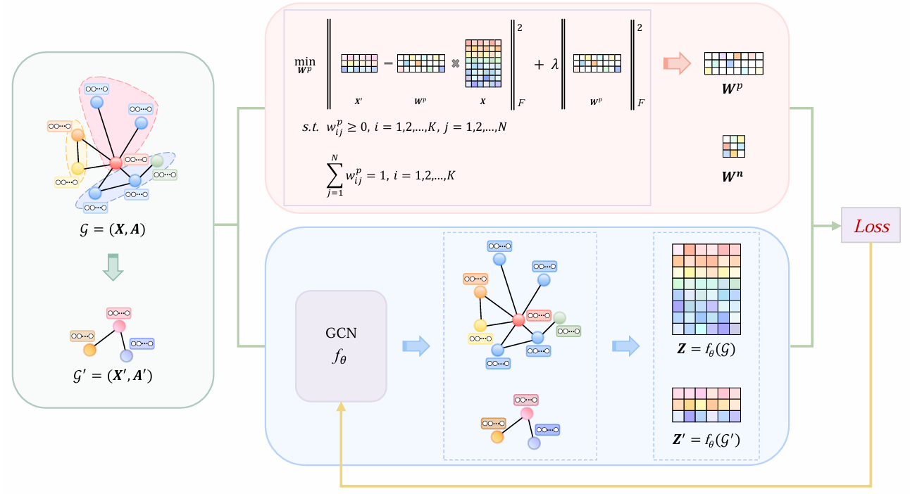

# CL-GCL:Comprehensive and Lightweight Graph Contrastive Learning
## CL-GCL architecture:


## 🚀 How to Run

Make sure you have the required Python environment and libraries installed. All required dependencies are listed in the `requirements.txt` file.

Then, run the main script using the following command:

```bash
python train.py
```
